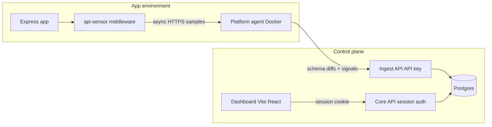

# Architecture

## Overview



## Components

### 1. Middleware (`packages/middleware`)

Thin Express middleware:

```js
app.use(apiSensor({
  agentUrl: process.env.API_SENSOR_AGENT_URL,
  apiKey: process.env.API_SENSOR_KEY,
  sampleRate: 1.0,
}))
```

- Captures method, path, status, latency, content-types, header names, truncated body **shapes**
- Redacts `authorization` / cookies / secret-ish fields before send (`packages/shared`)
- Buffers and flushes async; **never awaits** the agent on the request path
- Circuit breaker when the agent is down; always fail-open

### 2. Agent (`agent/`)

Docker service on `:8080`.

1. `POST /v1/samples` → **202** immediately
2. Async in-memory: path normalize → schema infer/merge → sensitive heuristics → auth observation
3. Flush inventory **deltas** to ingest (`POST /v1/inventory/upsert`)

No raw traffic to disk or DB. Optional debug ring buffer (`AGENT_DEBUG_BUFFER=true`).

**Path templating examples:**

| Raw | Template |
| --- | --- |
| `/api/users/42` | `/api/users/{id}` |
| `/api/users/550e8400-e29b-41d4-a716-446655440000` | `/api/users/{uuid}` |
| `/api/orders/99/items/3` | `/api/orders/{id}/items/{id}` |

### 3. Ingest API (`ingest/`, port 3002)

- Auth: `X-API-Key` (SHA-256 matched to `ApiKey.keyHash`)
- Idempotent upsert on `(projectId, method, pathTemplate)`
- Persists endpoints, schema fragments, counters, signal tags
- **Rejects / never stores raw bodies** (API only accepts derived inventory)

### 4. Core API (`backend/`, port 3001)

- Auth (vacation-home parity): register, login, magic-token request/login, logout, me
- Sessions: `express-session` + `connect-pg-simple` → Postgres `session` table
- Projects + API key minting (raw key shown once)
- Inventory reads under `requireAuth`

### 5. Dashboard (`frontend/`, port 5173)

- Vite proxy `/api` → core `:3001`
- Login / register / magic link
- Project list → inventory table → endpoint detail (schema tree + signals)

### 6. Demo app (`demo/express-app/`, port 4000)

Sample routes that exercise discovery: users CRUD-ish, login with JWT-shaped token, nested order paths.

## Data model (inventory)

| Model | Purpose |
| --- | --- |
| `User` / `MagicToken` / `Session` | Control-plane auth |
| `Project` / `ApiKey` | Tenant + agent pairing |
| `Endpoint` | method + pathTemplate + schemas + counters |
| `Signal` | sensitive_field / auth_observed tags |

## Ports

| Service | Port |
| --- | --- |
| Postgres | 5432 |
| Core API | 3001 |
| Ingest API | 3002 |
| Agent | 8080 |
| Frontend | 5173 |
| Demo app | 4000 |

## Trust boundaries

| Boundary | Auth |
| --- | --- |
| Middleware → Agent | API key in envelope / `X-API-Key` (forwarded to ingest) |
| Agent → Ingest | Same project API key |
| Browser → Core | Session cookie |
| Ingest writes | Never exposed to browser |
