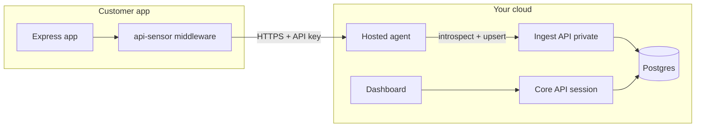

# Architecture

## Overview

Product path is **API Glimpse cloud** — customers install middleware that talks to our collector. See [PRODUCTIZATION.md](./PRODUCTIZATION.md).



## Components

### 1. Middleware (`packages/middleware`)

```js
app.use(apiSensor({
  agentUrl: process.env.API_SENSOR_AGENT_URL,
  apiKey: process.env.API_SENSOR_KEY,
  sampleRate: 1.0,
}))
```

- Captures method, path, status, latency, content-types, header names, truncated body **shapes**
- Redacts secrets before send
- Buffers and flushes async; **never awaits** the agent on the request path
- Circuit breaker when the agent is down; always fail-open

### 2. Hosted agent (`agent/`)

Public collector on `:8080` (prod: `collect.apiglimpse.com`; soft-launch may use Railway `*.up.railway.app`).

1. `POST /v1/samples` — require `X-API-Key` (or envelope `apiKey`)
2. Validate key via ingest `GET /v1/auth/introspect` (short TTL cache)
3. Invalid/missing → **401, drop** (no aggregation)
4. Rate limit per IP + key; body size cap
5. **202** then async process into a **per-project** aggregator
6. Flush inventory deltas to ingest with that project’s key

No raw traffic to disk or DB. Debug ring only when `NODE_ENV !== production` and `AGENT_DEBUG_BUFFER=true`.

### 3. Ingest API (`ingest/`, port 3002)

- **Private** in production (agent-only). Locally bound for POC convenience.
- Auth: `X-API-Key` (SHA-256 → `ApiKey.keyHash`)
- `GET /v1/auth/introspect` — key → project identity
- `POST /v1/inventory/upsert` — idempotent inventory writes
- `ENDPOINT_LIMIT` — skip *new* endpoints when over limit (existing still update)
- Never stores raw bodies

### 4. Core API (`backend/`, port 3001)

- Auth: register, login, magic-token, logout, me (vacation-home parity)
- Sessions in Postgres
- Projects + API key minting (raw key shown once)
- Inventory reads under `requireAuth`

### 5. Dashboard (`frontend/`, port 5173)

- Local: Vite proxy `/api` → core
- Production: static site on **Render** with build-time `VITE_API_URL` → public Railway core ([RENDER.md](./RENDER.md))
- Login / projects / inventory / endpoint detail

## Trust boundaries

| Boundary | Auth |
| --- | --- |
| Middleware → Agent | Project API key (`X-API-Key`) — validated before accept |
| Agent → Ingest introspect/upsert | Same project API key |
| Browser → Core | Session cookie |
| Ingest | Not exposed publicly in prod |

## Ports (local)

| Service | Port |
| --- | --- |
| Postgres | 5432 |
| Core API | 3001 |
| Ingest API | 3002 |
| Agent | 8080 |
| Frontend | 5173 |
| Demo app | 4000 |
