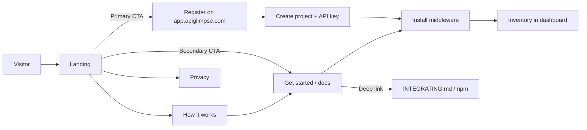

# Marketing site — IA & brand truth

**GTM / ads / multi-agent plan of record:** [MARKETING_PLAN.md](./MARKETING_PLAN.md) (positioning, ICP, LinkedIn + Google, site roadmap, workstreams **M0–M8**; security-platform north star with honest discovery-first public language).  
**Product readiness (dev) before marketing:** [MARKETING_READY.md](./MARKETING_READY.md) (streams **R1–R6**).  
**Future protect / blocking:** [PROTECT_MODE.md](./PROTECT_MODE.md) (**PM0–PM4**).

Product truth: [PRODUCTIZATION.md](./PRODUCTIZATION.md). Install detail: [INTEGRATING.md](./INTEGRATING.md). Public sites live in-repo:

| Surface | Path | Host |
| --- | --- | --- |
| Marketing | [`marketing/`](../marketing/) | `apiglimpse.com` |
| Docs | [`docs-site/`](../docs-site/) | `docs.apiglimpse.com` |
| Dashboard | [`frontend/`](../frontend/) | `app.apiglimpse.com` |

Deploy settings: [RENDER.md](./RENDER.md). Nick deploys to Render; this doc is **site IA + content/design truth**. Demand gen, paid ads, and channel strategy live in [MARKETING_PLAN.md](./MARKETING_PLAN.md).

Traffic-based **observe → inventory → risk**: connector (Express / Fastify / FastAPI / Go, …) → API Glimpse cloud → dashboard inventory / schemas / signals. Async sampling, schemas and signals (not raw bodies), API-key gated.

---

## Locked decisions

| Decision | Choice |
| --- | --- |
| **Brand name** | **LOCKED: API Glimpse** |
| **Primary domain** | **`apiglimpse.com`** (purchased) |
| **Dashboard host** | **`app.apiglimpse.com`** |
| **Collector / API hosts** | **`collect.apiglimpse.com`** (agent), **`api.apiglimpse.com`** (core) — see [PRODUCTIZATION.md](./PRODUCTIZATION.md) |
| **Marketing vs app** | **Separate marketing site** from the dashboard SPA |
| **Signup** | **Open self-serve**; honest soft-launch tone. Paid acquisition only after GTM gates in [MARKETING_PLAN.md](./MARKETING_PLAN.md) |
| **Billing / pricing page** | `/pricing` reads live `GET /api/billing/plans` — **no invented $**. Soft placeholder if API missing |

### Soft-launch control (not marketing)

**`ENDPOINT_LIMIT`** already exists on ingest:

- Env var on the **ingest** service
- Implemented in [`ingest/routes/inventory.js`](../ingest/routes/inventory.js) (`endpointLimit()`)
- Documented in `.env.example`, [ARCHITECTURE.md](./ARCHITECTURE.md), [PRODUCTIZATION.md](./PRODUCTIZATION.md)
- **`0` or unset = unlimited**; positive integer = skip *new* endpoints over the cap (existing endpoints still update)

Use this as an **ops / early-access control** when plan limits are not set. Prefer plan caps from billing when explaining limits publicly — do not invent prices or tiers on the client.

---

## Page inventory (implemented in `marketing/`)

| Page | Purpose |
| --- | --- |
| **/** Landing | Position the product, earn trust, one primary CTA |
| **/how-it-works** | Middleware → API Glimpse → inventory without architecture overload |
| **/get-started** | Install summary → links to `docs.apiglimpse.com` |
| **/pricing** | Free / Pro from `GET /api/billing/plans` when `VITE_API_URL` is set; soft placeholder (no fake $) if API missing |
| **/docs** | Redirects to `/get-started` (canonical developer docs are on the docs site) |
| **/privacy** | No raw bodies; what is stored (schemas/signals); retention high-level |
| **/terms** (lightweight) | Soft-launch ToS stub while registration is open |
| **404** | Brand-consistent dead end → home / app |

Invite-only **/early-access** is optional and **not** the current path (open signup is locked).

### Local / Render (marketing)

```bash
cd marketing && npm install && npm run dev
```

| Render setting | Value |
| --- | --- |
| Root directory | `marketing` |
| Build | `npm install && npm run build` |
| Publish | `dist` |
| Env | `VITE_APP_URL`, `VITE_DOCS_URL`, optional `VITE_COLLECT_URL` |
| Rewrite | `/*` → `/index.html` (SPA) |

Docs site: root `docs-site`, build `npm install && npm run build`, publish `docs/.vitepress/dist`. Details in [RENDER.md](./RENDER.md).

---

## Information architecture



**Journey A — Visitor → signup**  
Landing → value + trust → **Sign up** → `app.apiglimpse.com` register → create project → copy key → install.

**Journey B — Visitor → docs/install**  
Landing or nav → Get started → npm + env → dashboard for key → verify inventory.

**Nav (shallow):** Product / How it works / Pricing / Docs / Sign in · Sign up. Pricing stays honest — API catalog or soft placeholder, never invented Stripe prices.

---

## CTAs

| CTA | Target |
| --- | --- |
| **Primary — Sign up** | `https://app.apiglimpse.com` register |
| **Sign in** | Same app origin, login |
| **Secondary — Get started / Docs** | Marketing `/docs` or `/get-started` → deep link to [INTEGRATING.md](./INTEGRATING.md) / npm |
| Agent URL | Belongs in install docs / onboarding, not necessarily the hero |

Until custom domains are wired, CTAs may point at the live Render dashboard origin. Do not mix marketing chrome into the dashboard SPA.

---

## Content blocks (outline only)

### Landing (`/`)

1. Brand hero — **API Glimpse** + one line (see the live API surface from real traffic)
2. Single CTA group — Sign up · Docs · Sign in (nav)
3. How it works (3 steps) — middleware → traffic → inventory & signals
4. Trust — connector install; schemas & signals; API keys; stays off the critical path
5. Who it’s for — teams on supported connectors who want a live map of their API
6. Soft-launch honesty — early product; endpoint limits may apply; pricing only from live catalog
7. Footer — Privacy, Terms, Docs, contact

### How it works / Get started / Privacy

Customers configure `API_SENSOR_AGENT_URL` + `API_SENSOR_KEY`; install middleware; dashboard shows endpoints, schemas, signals. Privacy states processed vs stored and that raw bodies are not kept as long-lived records.

---

## Deferred (site) vs tracked in GTM plan

Still **out of scope for casual site edits** (see [MARKETING_PLAN.md](./MARKETING_PLAN.md) for when/how):

- Blog / SEO content mill (selective changelog + 1 category page OK via **M6**)
- Named competitor matrices
- Case studies / ROI calculators without real proof
- Protect-mode / blocking messaging ([PROTECT_MODE.md](./PROTECT_MODE.md) — not v1)
- In-app marketing routes inside the dashboard SPA
- Waitlist CRM (open signup is locked)

**Now planned in GTM streams:** analytics (**M1**), site connector truth + SEO hygiene (**M2**), campaign LPs (**M3**), Google/LinkedIn packages (**M4/M5**), creative kit (**M7**), lifecycle email (**M8**).

---

## Design constraints

Implemented in `marketing/` (forest-teal direction; Syne + Figtree + IBM Plex Mono via Google Fonts):

- Brand-first hero (product name dominant); one composition per first viewport
- No generic AI purple / cream-serif tropes; no card-heavy heroes
- Full-bleed surface-map visual (endpoint discovery context)
- Expressive typography (avoid Inter / system-default stacks)
- Motion for hierarchy (brand rise, path draw, subtle drift)
- Cards only where interaction needs a container

Name is locked — public surfaces use **API Glimpse**, not `api-security`.

---

## Relation to existing surfaces

| Marketing | Existing |
| --- | --- |
| Sign up / Sign in | Render dashboard (`frontend/`) → Railway core sessions |
| Install | Short marketing summary + canonical [INTEGRATING.md](./INTEGRATING.md) |
| Product truth | [PRODUCTIZATION.md](./PRODUCTIZATION.md) — middleware → API Glimpse cloud → dashboard |
| Endpoint limits | Ingest `ENDPOINT_LIMIT` (ops / early access), not a pricing story |

Marketing’s job ends at register or install docs. Onboarding (project → key → snippet) stays in-app.

### Next step: npm / package rename

Customer install is **`@apiglimpse/middleware`** (and `@apiglimpse/shared`). Publish to npm, keep INTEGRATING / docs-site / marketing install CTAs in sync with the published version.

Other rename follow-ons (not done yet): email `from@` / Resend domain on `apiglimpse.com`, repo/org rename if desired, Docker Compose service names, internal package.json names.

---

## Rejected / considered names (archive)

Nick’s bar: **names with meaning** (e.g. Traceable = follow the trail; Contrast = contrasting agent) — short, sayable, brandable. Tone: Traceable-level clarity + Contrast-level cleverness, but **warmer / punchier / more product-y** (Linear · Vercel · Sentry energy), not Latin lab coats. Avoid SecureShield / CloudGuard theater names.

**Locked choice:** **API Glimpse** — see “Glimpse” below (quick look that doesn’t keep the thing / see the live surface without storing requests). Domain: **`apiglimpse.com`**.

**Prior top picks set aside as too stuffy:** Contour, Aperture, Fathom (and the same-register thesaurus set — Assay, Silhouette, Specular, Meridian, Gnomon, Lucent, Umbra, etc.).

### Round 2 shortlist (considered, not chosen)

★ = were top recommendations before lock.

| | Name | Meaning | Why it was considered |
| --- | --- | --- | --- |
| ★ | **Imprint** | Mark left after contact | Traffic passes; only schemas/signals stick — observe-without-storing in one word |
| ★ | **Waymark** | Trail marker on a path | Marks routes real traffic actually takes; Traceable-warm, not academic |
| ★ | **Glimpse** → **API Glimpse** | A quick look that doesn’t keep the thing | **Chosen** — see the live surface without storing requests; friendly and sayable |
| ★ | **Tracelet** | Coinage: little tracer | Soft Traceable sibling — follow live calls, product-y made word |
| | **Wake** | Trail left behind a moving object | Requests move on; the wake *is* the discovered API surface |
| | **Sketch** | Rough outline of a form | Inventory as outline, not capture — shape of the API, not the bodies |
| | **Roster** | Who’s actually on the list | Punchy “what showed up in traffic” inventory energy |
| | **Spool** | Thread wound as it runs | Traffic winds through; you keep the wire’s shape, not the bytes |
| | **Clearcut** | Unambiguous / laid bare | Honest visible surface — Contrast cleverness, zero theater |
| | **Barewire** | Exposed wiring (coinage vibe) | See the bare wires of the real API from live traffic |
| | **Etch** | Engrave by contact | Permanent-feeling schema marks from transient requests |
| | **Ghostprint** | Print of what’s half-visible | Shadow-API adjacent without saying “shadow”; imprint of undocumented routes |

**Soft / secondary (usable, not lead):** Peek, Flare, Hitch, Rub (charcoal-rubbing of a surface — clever, maybe too obscure), Signpost, Tally, Speck, Afterimage (long), Livewire (**skip** — Laravel Livewire collision).

**Still not primary:** reusing **Contrast** ([Contrast Security](https://www.contrastsecurity.com/) owns AppSec) or **Traceable** — inspiration only.

### Former top-4 pitches (historical)

1. **Imprint** — Traffic touches your stack; only the shape sticks.
2. **Waymark** — Trail markers for every route real traffic actually takes.
3. **Glimpse** — See the live API surface without keeping the requests. → **locked as API Glimpse**
4. **Tracelet** — A light tracer for what’s really calling your APIs.

---

## Open / follow-ons

1. ~~Lock product name~~ → **API Glimpse** / **apiglimpse.com**
2. ~~Marketing + docs static apps~~ → `marketing/`, `docs-site/` (Nick deploys on Render)
3. ~~Custom domains~~ → wired (`apiglimpse.com` / `docs` / `app` / `collect` / `api`)
4. Trademark / social handle check still wise (adjacent AppSec brands).
5. Publish connectors so install CTAs stay honest ([NPM_PUBLISH.md](./NPM_PUBLISH.md), [CONNECTOR_PUBLISH.md](./CONNECTOR_PUBLISH.md)).
6. Execute GTM plan: [MARKETING_PLAN.md](./MARKETING_PLAN.md) (review checklist + agents **M1–M8**).
7. Clear product readiness gate: [MARKETING_READY.md](./MARKETING_READY.md) (**R1–R6** + Nick publish/Resend).
8. Protect epic stays future: [PROTECT_MODE.md](./PROTECT_MODE.md) (**PM0–PM4**) — do not advertise blocking early.
