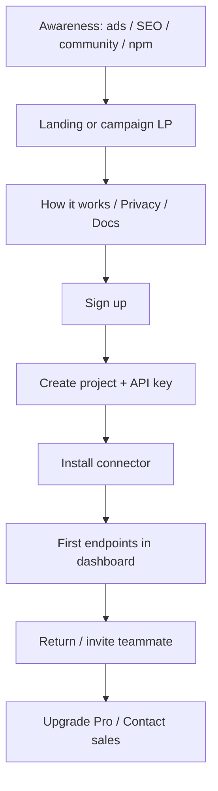

# Marketing GTM plan — API Glimpse

**Audience:** Nick reviews → locks decisions → launches parallel agents.  
**Status:** Plan of record (2026-08-26). Strategy + multi-agent execution.  
**Site IA / brand truth:** [MARKETING.md](./MARKETING.md). Product truth: [PRODUCTIZATION.md](./PRODUCTIZATION.md).  
**Product readiness (dev) before marketing:** [MARKETING_READY.md](./MARKETING_READY.md).  
**Future protect / blocking epic:** [PROTECT_MODE.md](./PROTECT_MODE.md).

This doc is the go-to-market plan that drives:

1. Updates to the static marketing site (`marketing/` → `apiglimpse.com`)
2. LinkedIn and Google Ads
3. Supporting channels (SEO, lifecycle email, developer communities, npm surfaces)
4. Measurement so spend and copy can be judged
5. Messaging that **leads with discovery today** while staying coherent with a **future API security platform** (optional blocking in connectors)

Plan mode is unavailable in this Cloud Agent session; this file is the reviewable plan of record.

---

## Why this plan now

Soft-launch infra is live (`apiglimpse.com` / `app` / `docs` / `api` / `collect`). The marketing site exists with honest soft-launch tone. Billing catalog + Admin plans exist; Stripe live keys and heavy paid acquisition are still gated on Nick.

**Problem:** Site IA alone does not create demand. Without ICP, messaging variants, paid landing paths, analytics, and channel ownership, LinkedIn/Google spend will burn budget on a homepage that was written for curiosity—not conversion campaigns.

**Goal:** Ship a coherent GTM system: who we sell to, what we say, where we show up, what agents build, and what Nick must unlock (ads accounts, pixels, Stripe, Resend, npm).

---

## Current state (truth)

| Surface | State |
| --- | --- |
| Brand | **API Glimpse** locked; forest-teal site; Syne + Figtree + IBM Plex Mono |
| Positioning line | “See what your API actually serves” / endpoints, schemas, field types from real traffic |
| Connectors (docs / code) | **Available in-repo:** Express, Fastify, NestJS, Next.js, FastAPI, Django, Flask, Go (chi), Spring Boot, ASP.NET Core, Nginx/OpenResty, Kong, Node gateway sidecar. **Coming soon:** Hono, Envoy. Truth: [INTEGRATING.md](./INTEGRATING.md) |
| Marketing site | Landing, how-it-works, get-started, pricing, privacy, terms |
| Pricing page | Live catalog via `GET /api/billing/plans` when API wired; no invented $ |
| Docs | VitePress at `docs.apiglimpse.com` |
| Signup | Open self-serve |
| Analytics / ads pixels | **Missing** |
| Blog / changelog | **Missing** (previously deferred) |
| Paid landing pages | **Missing** (ads would hit `/`) |
| Social / LinkedIn company | **Not specified** |
| Case studies / social proof | **None** |
| Email lifecycle beyond magic link | **None** |

Ops gates that block credible marketing: Resend domain mail ([LAUNCH_NEXT.md](./LAUNCH_NEXT.md)), npm/PyPI/Go publish honesty ([NPM_PUBLISH.md](./NPM_PUBLISH.md), [CONNECTOR_PUBLISH.md](./CONNECTOR_PUBLISH.md)), Stripe live if we advertise paid Checkout ([STRIPE.md](./STRIPE.md)).

**Plan catalog vs entitlements:** Admin can edit Free/Pro/Enterprise templates safely. Signup / assign **snapshots** `endpointLimit` + `seatLimit` onto the Organization; later catalog edits do not rewrite existing orgs/teams. See [ORG_PLAN_LIMITS.md](./ORG_PLAN_LIMITS.md). Marketing `/pricing` reads the **live catalog** (L8); usage/billing UI should report **org snapshots**.

---

## North star: API security platform

**Internal product north star (locked intent):** API Glimpse becomes a **traffic-based API security platform**. The same hosted path and language connectors that **observe → inventory → risk** today later support **optional protect**: local policy evaluation in the connector/agent path, including **blocking when the customer enables it**—fail-open by default, no per-request remote authorize. Roadmap: [PROTECT_MODE.md](./PROTECT_MODE.md) (**PM0–PM4**).

**Public language today:** still *traffic-based API inventory* / live API surface. Do **not** lead ads or the homepage with “API security platform,” “blocks attacks,” or “WAF” until protect phases ship and Nick unlocks claims.

### Why this sequencing

| Stage | Product | Marketing job |
| --- | --- | --- |
| **Now (G0–G2)** | Observe + inventory + signals + OpenAPI export | Acquire builders who feel docs drift / shadow routes; plant that Glimpse is the map you keep |
| **Shadow protect (PM1)** | Would-block metrics, still allow | Soft “path to enforce” on site/docs; still no block claims in ads |
| **Opt-in block (PM2)** | Connector deny + dashboard enable | Unlock security-platform narrative, AppSec keywords, LinkedIn security titles |
| **Policy UX / edge (PM3–PM4)** | Rules UI; OpenAPI → firewall playbook | Enterprise / contact-sales motion; careful competitor framing |

### Category ladder (honest)

```text
observe → inventory → risk signals → shadow protect → opt-in block → platform narrative
```

Plant the future **without lying**:

- Homepage / ads (now): discovery value only.  
- How-it-works / docs (optional, light): “Built so enforcement can stay local and fail-open later—protect is opt-in when you’re ready.” One sentence max; no feature page until PM1+.  
- Banned until unlock: prevents breaches, blocks attacks, replaces Traceable/Noname/Salt, fail-closed security appliance.

### Messaging unlock table

| Claim | Allowed when |
| --- | --- |
| See live endpoints / schemas from traffic | Now |
| Sensitive-field tags / exposure visibility | Now (modest) |
| Export OpenAPI from inventory | Now (shipped) |
| “Would have blocked” / shadow protect | After **PM1** + Nick |
| Opt-in request blocking in connectors | After **PM2** + fail-open proof + Nick |
| “API security platform” in ads/hero | After **PM2** stable + Nick (L1b) |
| Named competitor matrices | Nick + M6 only |

---

## Positioning

### One-liner (current public)

**API Glimpse shows the endpoints and fields your APIs actually serve—from real traffic.**

### One-liner (future public — post-PM2, Nick unlock)

**API Glimpse maps your live API surface—and can enforce policy in your connectors when you turn protect on.**

### Elevator (≈20s, current)

Docs and OpenAPI drift. Shadow and forgotten routes pile up. Drop a connector into Express, Nest, FastAPI, Spring, ASP.NET, Nginx/Kong, or another supported stack; API Glimpse builds a live inventory of methods, paths, schemas, and sensitive-field tags—without keeping raw bodies. Fail-open: your app keeps serving if we don’t. (Quietly: same path is designed for optional local protect later.)

### Positioning statement (internal)

For **engineering and AppSec-adjacent teams who own HTTP APIs**, API Glimpse is a **hosted, connector-based API security platform in the making**: start with **minutes-to-value traffic inventory**, grow into **risk visibility**, then **optional local blocking**—unlike heavy enterprise suites that require appliances and long RFPs before you see your own surface. **Until protect ships, we sell the map, not the gate.**

### Message pillars

**Current (use everywhere in G0–G2):**

| Pillar | Claim | Proof on product |
| --- | --- | --- |
| **Live surface** | Inventory from real traffic, not stale specs | Dashboard endpoints update as traffic hits |
| **Schemas not bodies** | Structure + tags; no long-lived raw payloads | Privacy page + redaction in connector |
| **Minutes to value** | Account → key → connector → inventory | Install snippet in-app + docs |
| **Fail-open** | Discovery never takes down the app | Circuit breaker / drop samples |
| **Honest scope** | Discovery-first; protect when ready | Soft-launch copy; no fake enterprise theater |

**Add after PM2 (do not use early):**

| Pillar | Claim | Proof |
| --- | --- | --- |
| **Opt-in protect** | Block matching routes locally when enabled | Per-service protect mode + deny metrics |
| **Policy at the edge of the app** | Cached rules, ~ms budget, no remote authorize | [PROTECT_MODE.md](./PROTECT_MODE.md) principles |
| **One connector path** | Same install grows from observe → enforce | Shared connector config shape |

### Voice

Warm, product-y, clear (Linear / Vercel / Sentry energy)—not Latin lab coats, not SecureShield theater. Prefer concrete verbs: *see*, *map*, *inventory*, *sample* (later: *enforce*, *protect* only when shipped). Avoid: *AI-powered*, *next-gen*, *comprehensive platform* without specifics—and avoid *API security platform* in public copy until **L1b** unlock.

### Locked brand lines (site)

From `marketing/src/lib/brand.js`:

- Name: **API Glimpse**
- Headline: **See what your API actually serves**
- Tagline: **Endpoints, schemas, and field types from real traffic.**

Campaign variants may A/B secondary headlines; do not replace the brand-first hero pattern ([MARKETING.md](./MARKETING.md) design constraints).

---

## ICP & personas

### Primary ICP (pay and install)

| Attribute | Target |
| --- | --- |
| Company | B2B SaaS / platform; 5–200 engineers |
| Stack | Node (Express/Fastify/Nest/Next), Python (FastAPI/Django/Flask), Go (chi), Java (Spring Boot), .NET (ASP.NET Core), or gateway (Nginx/Kong / Node sidecar) |
| Pain | Undocumented / drifted APIs; “what do we actually expose?”; prep for security review without buying enterprise API security |
| Buyer | Staff/Lead engineer, Platform, or AppSec-curious Eng Manager |
| Budget | Self-serve Free → Pro (~$29 placeholder until Nick locks); not six-figure RFP |
| Trigger | New service launch, OpenAPI debt, SOC2 / customer security questionnaire, shadow API surprise |

### Personas

| Persona | Job | What they need | CTA |
| --- | --- | --- | --- |
| **P1 Builder** | Ships APIs | Install in &lt;15 min; see inventory | Sign up → docs |
| **P2 Platform** | Owns shared Node/Python/Go standards | Connector that fails open; multi-service later (orgs) | Sign up + architecture docs |
| **P3 Security-adjacent** | Reviews exposure | Sensitive-field tags; no raw body retention; later shadow/block | Privacy + how-it-works → Sign up |
| **P4 Economic buyer** (later) | Eng Manager / Head of Platform | Clear Free vs Pro caps; seat story after orgs | Pricing → Contact sales / Upgrade |
| **P5 AppSec buyer** (post-PM2) | AppSec / Platform security | Opt-in protect, policy, audit of denies | Protect docs + security LP |

### Anti-ICP (do not spend paid budget here *yet*)

- Teams that need **blocking / WAF** on day one → **become ICP after PM2** (retarget with protect LP)
- Enterprises that require **SSO/SAML + RFP** before trial (until Enterprise plan + sales motion exist)
- Stacks with **no connector** (Hono, Envoy) unless campaign is waitlist-only
- “Store and replay all traffic” buyers

Keep a CRM/note list of “needs protect” signups for the PM2 launch wave.

---

## Competitive frame (use carefully)

Do **not** ship a public “vs Traceable” matrix until claims are reviewable. Internally:

| Alternative | How we differ **now** | How we differ **post-PM2** | Risk if we overclaim |
| --- | --- | --- | --- |
| Hand-maintained OpenAPI | We update from traffic | Same + enforce from lived surface | We don’t replace design-first OpenAPI workflows |
| Enterprise API security (Traceable, Noname, Salt, etc.) | Faster self-serve discovery; no appliance | Same connectors; protect opt-in without ripping out discovery | Feature parity / agents—we are not them on day one |
| APM / observability | Endpoint inventory + schema + tags | + policy actions | We’re not full observability |
| Classic WAF | N/A (don’t sell against WAF yet) | App-local API-aware rules vs generic WAF | Don’t claim WAF replacement |
| Do nothing | Shadow routes stay invisible | Same | Install cost |

Public copy **now:** contrast to **stale docs and blind spots**, not named competitors (until **M6**).  
Public copy **later:** “map then enforce” vs suites that gate discovery behind enterprise sales—still no fake parity tables.

---

## Funnel



**North-star activation:** first non-empty inventory within 24h of signup (project with ≥1 endpoint from real samples).

Marketing’s job ends at **register** or **install docs**. In-app onboarding owns project → key → snippet ([PARALLEL_PLAN.md](./PARALLEL_PLAN.md) W2 / [SAAS_PLAN.md](./SAAS_PLAN.md)).

### Conversion events to instrument

| Event | Where |
| --- | --- |
| `lp_view` | Marketing + campaign LPs |
| `cta_signup_click` | Marketing |
| `signup_complete` | Core / app |
| `project_created` | App |
| `key_created` | App |
| `first_sample_accepted` | Agent/ingest (product analytics) |
| `first_endpoint_visible` | App |
| `checkout_started` / `subscribed` | Billing |
| `contact_sales_submit` | Marketing pricing |

---

## Phased GTM

| Phase | When | Intent | Paid ads? | Security narrative |
| --- | --- | --- | --- | --- |
| **G0 Foundation** | Now | Messaging lock, analytics, site truth, SEO basics, creative kit; finish [MARKETING_READY.md](./MARKETING_READY.md) | No (or $0 learning) | Discovery only; one quiet “built for protect later” line max |
| **G1 Soft acquisition** | After marketing-ready gate | Small LinkedIn + Google tests; community; changelog | Tiny budgets, discovery LPs | Inventory / shadow-API / OpenAPI-from-traffic clusters |
| **G2 Self-serve growth** | Stripe live + real Pro Checkout | Scale winners; remarketing; pricing CTAs | Yes, measured | Still discovery-led; nurture “needs protect” list |
| **G3 Team / expansion** | Orgs + invites polished | Multi-seat messaging; light ABM | Yes | Team inventory + exposure reviews |
| **G4 Protect launch** | After **PM2** + Nick unlock | Security LP, AppSec titles, loosen some search negatives | Yes, separate campaigns | “Map then enforce”; opt-in block; fail-open story |

Do **not** run meaningful Google/LinkedIn spend before: [MARKETING_READY.md](./MARKETING_READY.md) gate, analytics, at least one campaign LP, working magic-link email, and install CTAs that match published packages.

---

## Channel strategy

### 1. Marketing site (owned, primary)

**Job:** Convert intent → signup or docs; support ads with dedicated LPs; stay brand-first.

**Near-term site updates (agents):**

| Change | Why |
| --- | --- |
| Sync connector list with docs | **Done for wave-2 stacks** — keep Home / How-it-works / Get started / docs-site aligned with [INTEGRATING.md](./INTEGRATING.md) when new connectors land |
| Soft-launch honesty refresh | Billing exists; avoid “billing later” stale lines where wrong |
| Campaign LPs (`/lp/...`) | Ads need single-message pages (hero + one CTA + proof) |
| OG / Twitter cards + sitemap + canonicals | Share + SEO hygiene |
| Pricing honesty when Stripe live | Real $ from catalog only |
| Optional `/changelog` or link out | Trust for returning visitors |

Design constraints remain those in [MARKETING.md](./MARKETING.md) (brand-first hero, no card-heavy heroes, forest-teal, motion for hierarchy).

### 2. Google Ads (search + later Performance Max carefully)

**Role:** Capture high-intent queries; do not educate cold audiences on brand alone.

**Theme clusters (draft keywords — finalize in M4):**

| Cluster | Example intents | LP angle |
| --- | --- | --- |
| API inventory / discovery | “api endpoint discovery”, “api inventory tool” | Live surface from traffic |
| Shadow API | “shadow api detection” | Undocumented routes from traffic |
| OpenAPI from traffic | “generate openapi from traffic” | Inventory → (OpenAPI export when W5 live) |
| Brand | “api glimpse” | Homepage |

**Negative keywords (G1–G2):** waf, firewall, dast, “api security platform” (until G4), blocking, “free openapi generator” DIY, jobs/hiring.

**G4 unlock (post-PM2):** move selected security terms from negatives into a **Protect** campaign mapped to `/lp/protect` (new LP stream)—do not mix with discovery RSAs.

**Structure:** Separate campaigns for Brand / Discovery / Shadow (+ Protect later). One ad group ↔ one LP. Exact/phrase first; broaden only after CTR/CVR known.

**Budget guidance (Nick):** Start very small; kill ads with no `signup_complete` within learning window. Prefer Search before display/PMax.

### 3. LinkedIn Ads + organic

**Role:** Reach P2/P3 titles; thought leadership; later ABM.

**Paid:**

- Job titles: Software Engineer, Staff Engineer, Platform Engineer, Engineering Manager, AppSec Engineer (light)
- Seniority: Mid–Senior; company size 11–200 (adjust after data)
- Creative: problem → glimpse metaphor → single CTA (Sign up or Docs)
- Formats: Single image / document ads (1-pager PDF) before video
- Landing: `/lp/linkedin-inventory` not generic `/` when testing

**Organic (ongoing, light):**

- Company page: product updates, connector launches, privacy posture
- Founder posts &gt; corporate blandness
- Comment in API/AppSec threads with substance, not spam

### 4. Developer organic / community (high leverage, low $)

| Channel | Play |
| --- | --- |
| npm / PyPI / Go module READMEs | Treat as marketing surface; link to docs + signup |
| Show HN / launch post | Once activation + email work; honest soft-launch |
| Reddit / Discord | Answer API docs drift questions; no hard sell |
| Dev.to / short technical posts | “How we infer schemas without storing bodies” |
| Docs SEO | Integrating guides for each connector as indexable pages |

### 5. Lifecycle email (after Resend)

| Trigger | Email |
| --- | --- |
| Signup, no project 24h | Create a project + what you’ll see |
| Project, no key / no traffic 24h | Install snippet + docs link |
| First endpoint | “You’re live” + what to look for (sensitive tags) |
| Near endpoint cap | Upgrade / manage (when billing live) |
| Invite (orgs) | Existing invite path |

Magic link alone is auth, not marketing lifecycle.

### 6. Content / SEO (selective — not a content mill)

Previously deferred “blog factory” stays **out**. Instead ship **few high-intent pages**:

1. Changelog (minimal)
2. “API inventory from traffic” educational page (supports ads + SEO)
3. Privacy deep-dive (already partly on `/privacy`)
4. Per-connector landing sections or docs (indexable)

### 7. Partner / directory (later)

Product Hunt, Startups.co tool directories, Awesome lists—only after G1 activation metrics look sane.

---

## Gaps — what you’re missing today

Prioritized for Nick + agents:

| # | Gap | Why it matters | Stream |
| --- | --- | --- | --- |
| 1 | **No analytics / conversion tracking** | Can’t judge ads or site CTAs | M1 |
| 2 | **Marketing site connector copy stale** | Undercuts trust vs docs | M2 |
| 3 | **No campaign landing pages** | Paid traffic on `/` mixes messages | M3 |
| 4 | **Ads accounts + UTMs + offline conversions** | LinkedIn/Google need setup | N-M1 (Nick) + M4/M5 |
| 5 | **Creative kit** (OG images, ad images, logo lockups) | Ads and social shares look unfinished | M7 |
| 6 | **Lifecycle email beyond magic link** | Leaky activation | M8 |
| 7 | **Social proof** (design partners, quotes, logos) | Cold ads convert poorly | Nick + later M6 |
| 8 | **Remarketing audiences** | Cheap second touch after LP view | After M1 + ads |
| 9 | **Open Graph / sitemap / robots** | Shares + crawl | M2 |
| 10 | **Pricing/sales narrative for Enterprise** | Contact sales exists; no sales one-pager | M7 |
| 11 | **Competitive / category SEO pages** | Deferred until claims safe | M6 |
| 12 | **Product Hunt / launch choreography** | One-shot; easy to waste | G1 checklist |
| 13 | **Attribution in Admin** | Know which UTMs create paying users | M1 + light backend |
| 14 | **Legal polish for ads** | Privacy/terms must match claims | Review with M2 |

**Product readiness gaps** (Resend, publish, site/docs truth, Checkout honesty, multi-stack install UI) are owned by **[MARKETING_READY.md](./MARKETING_READY.md)** streams **R1–R6** / **N-R\***—run those before or in parallel with early **M\*** work, not instead of them.

OpenAPI export (shipped) unlocks a strong Google cluster. Orgs/invites unlock “team” LinkedIn messaging. Protect unlocks G4 security spend ([PROTECT_MODE.md](./PROTECT_MODE.md)).

---

## Locked vs open decisions

### Propose as locked (confirm in review)

| ID | Decision | Proposal |
| --- | --- | --- |
| L1 | Category language **now** | “Traffic-based API inventory” / live API surface — **not** “API security platform” in G0–G2 ads |
| L1b | North star | Internal: API security platform with **opt-in connector blocking**; public unlock only after **PM2** + Nick |
| L2 | Primary CTA | **Sign up**; secondary **Docs** |
| L3 | Ads before activation instrumentation | **No meaningful spend** until marketing-ready gate + M1 events fire |
| L4 | Named competitor pages | **Off** until Nick approves M6 |
| L5 | Soft-launch tone | Keep honesty; do not fake customers, prices, or blocking |
| L6 | Brand hero rules | Unchanged from [MARKETING.md](./MARKETING.md) |
| L7 | Protect teaser | At most one sentence on how-it-works/docs until PM1; no protect LP until G4 |

### Nick must lock

| ID | Decision | Notes |
| --- | --- | --- |
| K1 | Pro price + Free/Pro endpoint caps for **catalog / new signups** | Admin/Stripe; marketing displays catalog. Existing orgs keep snapshots ([ORG_PLAN_LIMITS.md](./ORG_PLAN_LIMITS.md)) |
| K2 | Google Ads + LinkedIn Ads account ownership / billing | Who pays; monthly cap |
| K3 | Analytics vendor | Proposal: **Plausible or PostHog** (privacy-aligned) + ad pixels as needed |
| K4 | Company LinkedIn page + handles | Create/claim `API Glimpse` |
| K5 | Design-partner outreach | 3–5 teams for quotes |
| K6 | When to announce publicly (HN / LinkedIn) | After N1 Resend + connector publish |
| K7 | Enterprise contact routing | Where `contact_sales` emails go |

---

## Multi-agent workstreams

### How to run in parallel

| Rule | Detail |
| --- | --- |
| One agent per stream ID (`M0`…`M8`) | Avoid two agents editing the same marketing files |
| Respect **Blocked by** | Don’t write Google ads before LPs + analytics |
| Nick-only streams (`N-M*`) | Ads accounts, pixels, budgets, partner quotes |
| Cost | No paid ads without Nick budget lock; prefer free organic first |
| Do not conflict with | Billing schema agents on Prisma; keep marketing agents in `marketing/`, `docs-site/`, `docs/` |

Suggested first wave: **M0 ∥ M1 ∥ M2** (after Nick skims this doc).  
Second wave: **M3 ∥ M7** (LPs + creative).  
Third wave: **M4 + M5** (ads copy/structure — Nick turns campaigns on).  
Then: **M8** lifecycle; **M6** only if approved.

---

### N-M* — Nick-only (not agent code)

#### N-M1 — Analytics + ad accounts

1. Choose analytics (Plausible **or** PostHog recommended for privacy story).  
2. Create Google Ads + LinkedIn Campaign Manager accounts; set hard monthly cap.  
3. Create UTM convention (below).  
4. Add domain to ad pixels only as required; document IDs in Render env (never commit secrets).

**UTM convention:**

```text
utm_source=google|linkedin|newsletter|github
utm_medium=cpc|organic|social|email
utm_campaign=<phase>_<offer>   e.g. g1_api_inventory
utm_content=<creative_id>
utm_term=<keyword>             # search only
```

**Done when:** Marketing can load analytics in prod; Nick has ads accounts ready.

#### N-M2 — Launch readiness

Resend + published connectors + smoke path ([LAUNCH_NEXT.md](./LAUNCH_NEXT.md)).  
**Done when:** Magic link works; `npm`/`pip`/Go install from public registries matches docs.

#### N-M3 — Budget + creative approval

Approve first-wave ad copy and LP screenshots; set search/LinkedIn daily caps.  
**Done when:** Agents’ M4/M5 copy can be pasted into ads UIs.

---

### M0 — Messaging & GTM source of truth (this doc + brand kit text)

**Goal:** Single messaging sheet agents and ads must follow.  
**Depends on:** Nick skim of positioning section.  
**Touches:**

- `docs/MARKETING_PLAN.md` (this file)
- `docs/MARKETING.md` (cross-links; stale flags)
- Optional: `marketing/src/lib/brand.js` only if Nick locks new tagline

**Tasks:**

1. Keep pillars / ICP / banned phrases updated here.  
2. Add “Banned claims” list for ads review.  
3. Sync README docs index to point at this plan.

**Banned claims (v1):**

- “Prevents breaches” / “blocks attacks” (protect mode not shipped)
- “Replaces Traceable/Noname/Salt”
- Invented customer logos or ROI %
- Invented prices not returned by billing API
- “Stores full request bodies for analysis”
- Invented “Available” connectors that are not in [INTEGRATING.md](./INTEGRATING.md) (today Hono / Envoy are coming soon — do not advertise as GA)

**Out of scope:** Implementing LPs or ads UI.

---

### M1 — Analytics & conversion instrumentation

**Goal:** Know what marketing does.  
**Depends on:** N-M1 vendor choice (or agent stubs behind env flags).  
**Touches:**

- `marketing/` (script loader, event helpers on CTA clicks)
- Optional light `frontend/` signup success event
- `docs/MARKETING_PLAN.md` event table stay in sync
- Render env docs in [RENDER.md](./RENDER.md)

**Tasks:**

1. Add privacy-friendly analytics snippet gated by env (`VITE_ANALYTICS_*`).  
2. Fire `cta_signup_click`, `cta_docs_click`, `lp_view` (path).  
3. Document how to mark `signup_complete` (app) with same anonymous id / UTM persistence (localStorage → register payload **only if** product accepts; else UTM on first landing cookie).  
4. Respect privacy page—disclose analytics if used.

**Out of scope:** Full product warehouse; selling data.

---

### M2 — Marketing site truth & SEO foundation

**Goal:** Site matches product; crawl/share hygiene.  
**Depends on:** None (parallel with M1).  
**Touches:** `marketing/src/pages/*`, `marketing/index.html`, maybe `public/robots.txt`, `sitemap.xml`, OG image.

**Tasks:**

1. Keep Home / How it works / Get started connector lists matched to [INTEGRATING.md](./INTEGRATING.md) (full Available set + Hono/Envoy soon).  
2. Refresh any “billing later / Express-only” stale copy.  
3. Add OG title/description/image; Twitter card tags.  
4. Add `sitemap.xml` + `robots.txt`.  
5. Ensure `/pricing` soft-launch disclaimer still accurate given Admin plans.

**Out of scope:** New blog engine; redesign brand.

---

### M3 — Campaign landing pages

**Goal:** Dedicated LPs for Google + LinkedIn tests.  
**Depends on:** M0 messaging; ideally M1 events.  
**Touches:** `marketing/src/App.jsx`, `marketing/src/pages/lp/*`, header/footer variant (minimal chrome OK).

**Tasks:**

1. Routes e.g. `/lp/api-inventory`, `/lp/shadow-api`, `/lp/linkedin`.  
2. Each LP: brand-first, **one** headline variant, one supporting sentence, one primary CTA (Sign up), one secondary (Docs), privacy one-liner—no card grids, no stats theater.  
3. UTM preserved through AuthModal signup if possible.  
4. Reuse forest-teal system; full-bleed visual ok.

**Out of scope:** Personalization engine; many experiments at once (max 3 LPs in v1).

---

### M4 — Google Ads campaign package

**Goal:** Ready-to-enter Search campaigns (copy, keywords, LP map).  
**Depends on:** M3 LPs live; N-M1 account; M1 tracking.  
**Touches:** `docs/ads/google-search-v1.md` (new); no need to call Google API from repo.

**Tasks:**

1. Write 2–3 RSA headline/description sets per cluster (Brand, Inventory, Shadow).  
2. Keyword lists + negatives.  
3. Map ad group → LP URL with UTMs.  
4. Conversion actions checklist for Nick (signup, contact sales).  
5. Explicit **do not launch** until N-M3.

**Out of scope:** Spending money; Display/YouTube.

---

### M5 — LinkedIn Ads + organic package

**Goal:** Campaign + 2 weeks organic post outlines.  
**Depends on:** M3; N-M1 LinkedIn page/account.  
**Touches:** `docs/ads/linkedin-v1.md` (new).

**Tasks:**

1. Audience definitions (titles, company size).  
2. 3 ad creatives text + image brief (point at M7 assets).  
3. Organic post outlines: connector launch, privacy posture, “stale OpenAPI” narrative.  
4. LP: `/lp/linkedin` + UTMs.

**Out of scope:** Agency process; Sponsored InMail until Search/LinkedIn feed proves out.

---

### M6 — Category / proof pages (optional, gated)

**Goal:** SEO/proof without competitor theater.  
**Depends on:** Nick unlock; preferably 1+ design partner quote (K5).  
**Touches:** `marketing/` new routes e.g. `/api-inventory`, `/customers` (only with real proof).

**Tasks:**

1. One category explainer page supporting Google cluster.  
2. Customers/testimonials **only** with approved quotes.  
3. Still no named competitor attack pages unless Nick asks.

**Out of scope:** ROI calculator; fake case studies.

---

### M7 — Creative asset kit

**Goal:** Shareable visuals consistent with brand.  
**Depends on:** M0.  
**Touches:** `marketing/public/og.png` (or svg→png), `docs/ads/creative-brief.md`, optional export of SurfaceMap still.

**Tasks:**

1. OG image with brand wordmark + short line.  
2. LinkedIn/Google image specs (1200×627, etc.) briefs or generated assets.  
3. One-pager PDF outline for document ads (problem → product → CTA).

**Out of scope:** Video production (phase G2+).

---

### M8 — Lifecycle email (activation)

**Goal:** Recover signups who never connect middleware.  
**Depends on:** N1 Resend; product can send non-auth email.  
**Touches:** `backend/` email templates/triggers (coordinate—**do not** parallel conflicting auth email refactors); copy in `docs/ads/lifecycle-v1.md` if code deferred.

**Tasks:**

1. Spec + implement 2–3 activation emails (see channel section).  
2. Unsubscribe / quiet respect.  
3. Align copy with marketing pillars.

**Out of scope:** Full marketing automation platform; newsletter blast list buys.

---

## Dependency graph

```text
Nick reviews MARKETING_PLAN
        │
        ├─► M0 messaging lock
        │
        ├─► N-M1 analytics + ads accounts ─► M1 instrumentation
        │                                      │
        ├─► M2 site truth + SEO ───────────────┤
        │                                      ▼
        │                              M3 campaign LPs
        │                                │         │
        │                         M7 creative      │
        │                                │         │
N-M2 launch readiness                M4 Google   M5 LinkedIn
        │                                │         │
        └──── N-M3 approve spend ◄───────┴─────────┘
                        │
                        ▼
                 G1 soft acquisition
                        │
              M8 lifecycle (Resend)
                        │
              M6 proof pages (optional)
```

---

## Suggested agent prompts (copy-paste)

**M1:**  
> Implement analytics/conversion instrumentation per `docs/MARKETING_PLAN.md` workstream M1 only. Env-gate vendor snippets; fire CTA events on the marketing site; update RENDER/docs for env vars. Do not launch ads or invent pixels without env placeholders.

**M2:**  
> Update the marketing site per `docs/MARKETING_PLAN.md` M2: sync connector availability with `docs/INTEGRATING.md` (all Available stacks; Hono/Envoy soon), fix stale soft-launch billing copy, add OG tags + sitemap/robots. Keep brand-first design constraints in `docs/MARKETING.md`. No new blog.

**M3:**  
> Add campaign landing pages per `docs/MARKETING_PLAN.md` M3 (`/lp/api-inventory`, `/lp/shadow-api`, `/lp/linkedin`). One composition, one primary CTA (Sign up). Do not edit billing/Prisma.

**M4:**  
> Author Google Search campaign package as markdown under `docs/ads/google-search-v1.md` per M4. No spend. Map to existing LPs. Follow banned claims list.

**M5:**  
> Author LinkedIn ads + organic package under `docs/ads/linkedin-v1.md` per M5. Follow banned claims. No API spend integrations.

**M7:**  
> Create OG/ad creative kit per M7; add `marketing/public` OG asset and `docs/ads/creative-brief.md`. Match forest-teal brand; no purple AI aesthetic.

**M8:**  
> Spec/implement activation lifecycle emails per M8 only after Resend works. Coordinate with existing magic-link mailer; do not break auth email.

---

## Success metrics

| Phase | Metric | Target (directional) |
| --- | --- | --- |
| G0 | Analytics receiving pageviews + CTA events | Working in prod |
| G0 | Site connector list matches docs | 100% |
| G1 | Signup → first endpoint ≤24h | Track baseline; improve via M8/W2 |
| G1 | Search/LinkedIn CPA to signup | Learn; pause if zero activations |
| G2 | Free → Pro conversion | Baseline after Stripe live |
| G2 | Paid CAC vs willingness to pay | Nick judgment; kill losers |

Vanity metrics (raw impressions, unattributed traffic) are secondary.

---

## Explicit non-goals

- Content/SEO mill or daily blog quota  
- Fake customers, fake prices, **or protect-mode advertising before PM2 unlock**  
- In-dashboard marketing chrome / interstitials  
- Large ABM or enterprise field marketing before orgs + Enterprise plan narrative  
- Buying email lists  
- Running Performance Max / broad display as first experiments  
- Implementing protect inside GTM agents (use [PROTECT_MODE.md](./PROTECT_MODE.md) / PM\* later)  

---

## Relation to other plans

| Doc | Role |
| --- | --- |
| [MARKETING.md](./MARKETING.md) | Site IA, CTAs, design constraints, brand archive |
| [MARKETING_READY.md](./MARKETING_READY.md) | **Dev multi-agent plan** to reach almost-ready-for-marketing (**R1–R6**) |
| [PROTECT_MODE.md](./PROTECT_MODE.md) | Future observe→shadow→block epic (**PM0–PM4**); claim unlocks |
| [PARALLEL_PLAN.md](./PARALLEL_PLAN.md) | Older W1–W8 — much already shipped; don’t rebuild blindly |
| [SAAS_PLAN.md](./SAAS_PLAN.md) | Orgs/teams — unlocks multi-seat marketing later |
| [LAUNCH_NEXT.md](./LAUNCH_NEXT.md) | Resend + connector publish + smoke |
| [STRIPE.md](./STRIPE.md) | When Checkout is real for Pro $ |
| [PRODUCTIZATION.md](./PRODUCTIZATION.md) | Hosted multi-tenant agent product shape |

---

## Review checklist for Nick

Before launching marketing agents or ads:

1. [ ] Agree L1–L7 (incl. security north star + public language now); lock or edit K1–K7  
2. [ ] Clear [MARKETING_READY.md](./MARKETING_READY.md) gate (or accept listed waivers)  
3. [ ] Pick analytics vendor (K3) and create ads accounts (N-M1)  
4. [ ] Confirm connector publish status matches what we will advertise  
5. [ ] Resend magic link works in production  
6. [ ] Product agents first if needed: **R1 + R3 + R4**; GTM: **M1 + M2** then **M3 + M7**  
7. [ ] No paid spend until LPs + events exist and N-M3 signed off  
8. [ ] Protect / “security platform” ads parked until **PM2** + explicit unlock  
9. [ ] Soft-launch: prefer quality conversations over vanity traffic  

---

## Open follow-ons

1. Trademark / handle check for “API Glimpse” adjacent AppSec brands (still wise).  
2. Sales one-pager PDF once Enterprise contact volume appears.  
3. Localization — not planned.  
4. **G4 protect launch kit** (LP, RSA set, LinkedIn AppSec audience) when [PROTECT_MODE.md](./PROTECT_MODE.md) PM2 ships.  
5. Optional how-it-works sentence planting the protect path (L7) — product agent or M2.  
