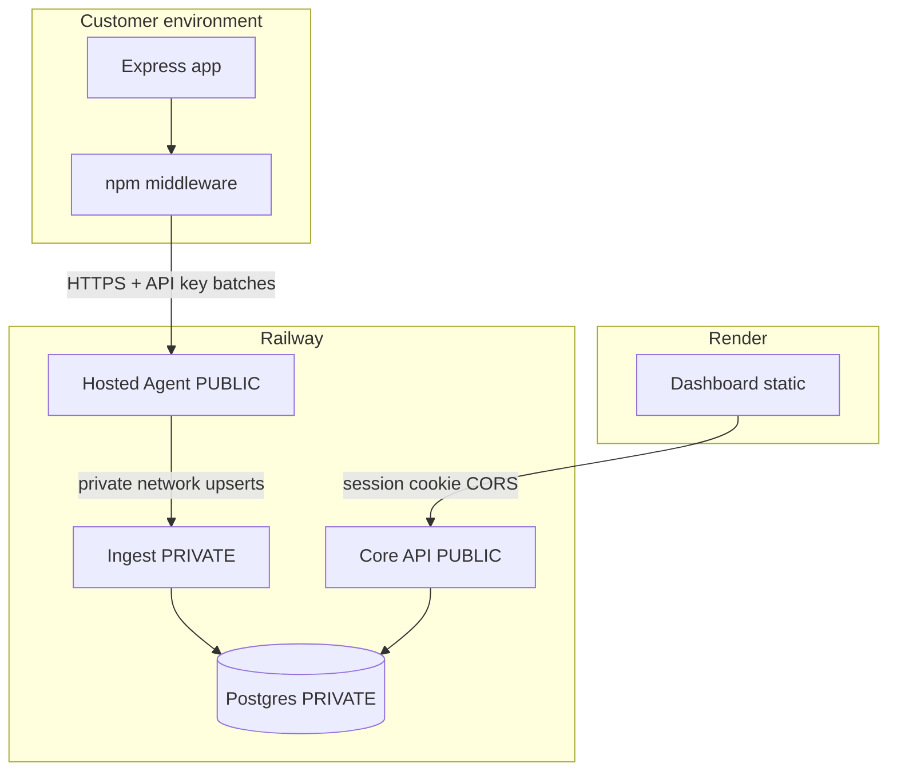

# Productization

Turning this POC into a Traceable/Noname-shaped **API discovery SaaS** — public brand **API Glimpse** (`apiglimpse.com`).

**Product path (locked):** Noname-style — **hosted multi-tenant agent**. Customers install middleware that talks to *your* cloud collector. We are **not** pursuing customer-hosted agents as a product line.

**Hosting split (locked):**

| Piece | Host |
| --- | --- |
| Postgres, private ingest, public agent, public core | **Railway** — [RAILWAY.md](./RAILWAY.md) |
| Dashboard (static SPA) | **Render** — [RENDER.md](./RENDER.md) |

Soft-launch: Railway `*.up.railway.app` + Render `*.onrender.com` are OK as interim hosts. Custom domains on **apiglimpse.com**: `app.apiglimpse.com` (dashboard), `collect.apiglimpse.com` (agent), `api.apiglimpse.com` (core).

Billing (Stripe, per-endpoint plans) comes later. At launch we only need an **endpoint quota stub** at ingest (env-configurable limit on *new* endpoints).

---

## Tenancy (one collector for everyone)

| Service | Count at launch | Isolation |
| --- | --- | --- |
| Agent | **1** public | API key → `projectId`; per-project in-memory aggregators |
| Ingest | **1** private | Upserts scoped by `projectId` |
| Core | **1** public | Session users + projects |
| Postgres | **1** | `projectId` on every inventory row |

Customers never get a dedicated agent container. Scale later = **replicas of the same multi-tenant services**, not per-customer deploys. Details: [RAILWAY.md](./RAILWAY.md#tenancy-vs-service-count).

---

## Target architecture



| Piece | Public? | Auth | Role |
| --- | --- | --- | --- |
| Dashboard (Render) | Yes | Session | Humans |
| Core API (Railway) | Yes | Session (auth routes open) | Projects, inventory reads, key minting |
| **Hosted agent** `POST /v1/samples` | Yes | **Project API key** | Sample intake + aggregation |
| Ingest | **No** (Railway private network) | API key | Inventory upserts only |
| Postgres | **No** | DB creds | Source of truth |

Middleware never talks to ingest. Ingest is not on the public internet in this topology.

Customer config:

```bash
API_SENSOR_AGENT_URL=https://<agent>.up.railway.app
API_SENSOR_KEY=ask_xxx
```

---

## What is open to the public

| Surface | Receives | Without valid credentials |
| --- | --- | --- |
| Agent (Railway) | Highest volume — batched sample POSTs from middleware | **401 + drop** (no processing) |
| Core (Railway) | Low — browser session traffic from Render | 401 on protected routes; auth endpoints accept register/login |
| Dashboard (Render) | Low — static UI | Login wall |
| `/health` on public services | Platform probes | Allowed; response is info-poor (`{status:"ok"}`) |

**Product rule for machine paths:** no API key → no work. Invalid key → drop. Do not queue, do not aggregate.

Browser paths use sessions, not API keys. Cross-origin Render → Railway uses `credentials: 'include'` + core `FRONTEND_URL` CORS + `SameSite=None; Secure` cookies in production.

---

## Traffic expectations

| Component | Relative volume | Notes |
| --- | --- | --- |
| Hosted agent (public) | Highest | Scales with customer RPS × sampleRate. Batching keeps HTTP POST rate much lower than app RPS. |
| Ingest (private) | Medium–low | Aggregated inventory deltas every ~1–2s per active project. |
| Core + UI | Low | Human dashboard use. |
| Postgres | Ingest-driven writes + read queries | Hot uniqueness: `(projectId, method, pathTemplate)`. |

Aggregation in the agent is load-bearing: do not write every raw request to ingest/DB.

---

## Security requirements

### Must (before real public traffic)

- [x] Ingest already requires API key for upserts
- [x] Agent requires + **validates** API key **before** returning 202
- [x] Invalid/missing key → 401, no aggregation
- [x] Per-project in-memory aggregators (no shared global state across tenants)
- [ ] Agent → ingest over private URL only (Railway deploy; locally host/localhost)
- [x] Body size caps + basic rate limits on agent
- [x] Debug ring buffer off / unavailable in production
- [x] Secure session cookies + `trust proxy` on core (when `NODE_ENV=production`)
- [x] Never persist raw request/response bodies
- [x] Endpoint quota stub (`ENDPOINT_LIMIT` env) on new endpoints
- [x] Dockerfiles for ingest + backend; agent hardened with `NODE_ENV=production`
- [x] Frontend production API base via `VITE_API_URL` + `credentials: 'include'`

### Should (soon after soft launch)

- Key revoke / rotate in UI
- Multiple keys per project
- Structured logs without sample payloads
- Abuse signals (spike in new endpoints, rejected keys)
- Optional IP allowlists per project

### Endpoint quota (Stripe later)

On ingest, when creating a **new** endpoint only:

```text
if !exists(projectId, method, pathTemplate)
  AND endpointCount >= plan.endpointLimit
  → reject (402/403), do not insert
```

Existing endpoints still update schemas/counters. Until Stripe: `ENDPOINT_LIMIT` env (`0` or unset = unlimited).

---

## Service map

| Service | Repo path | Host | Public domain | Notes |
| --- | --- | --- | --- | --- |
| Postgres | Railway plugin | Railway | No | Shared by core + ingest |
| `core` | `backend/` | Railway | `*.up.railway.app` (later `api.apiglimpse.com`) | Session API |
| `ingest` | `ingest/` | Railway | **Private** | Internal hostname from agent |
| `agent` | `agent/` | Railway | `*.up.railway.app` (later `collect.apiglimpse.com`) | Multi-tenant collector |
| `web` | `frontend/` | **Render** | `*.onrender.com` (later `app.apiglimpse.com`) | `VITE_API_URL` → core |

Publish `@apiglimpse/middleware` to npm so customers don’t use `file:` paths — [NPM_PUBLISH.md](./NPM_PUBLISH.md).

---

## Phased delivery

### Phase 0 — Prod harden (done in repo)

1. Agent: authenticate API key via ingest introspect (cached) before 202
2. Per-project aggregators + flush with that project’s key
3. Rate limit + body caps; prod-safe health/debug
4. Ingest: `ENDPOINT_LIMIT` stub on new endpoints
5. Docs aligned to hosted-agent-only path

### Phase 1 — Soft launch (Railway + Render)

**Repo prep (done):** Dockerfiles, [RAILWAY.md](./RAILWAY.md), [RENDER.md](./RENDER.md), frontend `VITE_API_URL` wiring, npm package metadata.

**Click-ops (Nick):**

- [ ] Deploy Postgres + private ingest + public core + public agent on Railway
- [ ] Deploy static frontend on Render with `VITE_API_URL`
- [ ] Set core `FRONTEND_URL` to Render origin
- [ ] `npm publish` shared + middleware
- [ ] Run [launch verification checklist](#launch-verification-checklist)
- [ ] Endpoint limit via env as needed; basic metrics optional post-launch

### Phase 2 — Product credibility

- Key revoke/rotate, multiple keys
- Path templating / schema merge quality
- OpenAPI export
- Onboarding polish (create project → copy install snippet with real agent URL)

### Phase 3 — Breadth (still Noname-shaped)

- More language connectors / proxy sensors (still → hosted agent) — plan: [CONNECTORS_PLAN.md](./CONNECTORS_PLAN.md)
- Protect mode / policy cache
- Stripe → map plan to `endpointLimit`
- Later: scale **agent replicas** (still one URL, still multi-tenant)
- **Out of scope:** customer-hosted agent product line

---

## Launch verification checklist

Cannot be fully automated from this repo — run against live URLs after click-ops.

### Railway

- [ ] `GET https://<core>/api/health` → `{ status: "ok", service: "core" }`
- [ ] `GET https://<agent>/health` → ok
- [ ] Ingest has **no** public domain; not reachable from the internet
- [ ] Agent `INGEST_URL` uses `http://ingest.railway.internal:<port>` (or your private hostname)
- [ ] `POST /v1/samples` without key → `401`
- [ ] With valid key + traffic → upserts succeed (check dashboard / DB)

### Render + CORS

- [ ] Dashboard loads at Render URL
- [ ] Register / login works (session cookie set for Railway core)
- [ ] Core `FRONTEND_URL` equals Render origin exactly
- [ ] Create project → copy API key

### End-to-end

- [ ] Demo or customer app: `API_SENSOR_AGENT_URL` + `API_SENSOR_KEY` → inventory on dashboard within seconds
- [ ] Bad key → agent `401`; app still serves traffic (fail-open)
- [ ] Ingest unavailable → agent does not accept unauthenticated work (auth/introspect failure path)
- [ ] Postgres: schemas/signals only — no raw bodies

### npm

- [ ] `npm view @apiglimpse/middleware` shows published version
- [ ] Fresh `npm install @apiglimpse/middleware` works outside this repo

---

## Local vs production agent wiring

| | Local POC | Production |
| --- | --- | --- |
| Middleware → agent | `http://localhost:8080` | `https://<agent>.up.railway.app` |
| Agent → ingest | `http://host.docker.internal:3002` or localhost | Private Railway URL |
| Dashboard → core | Vite proxy `/api` | `VITE_API_URL` → Railway core |
| Multi-tenant | Keys from dashboard; agent validates each request | Same |
| Ingest public? | Bound on localhost (dev convenience) | **No** |

---

## Explicit non-goals

- Customer-hosted / Traceable-style platform agent as a supported SKU
- Frontend on Railway (Render is the chosen host)
- Storing or replaying full live traffic
- Matching enterprise Traceable/Noname feature breadth at launch
- Runtime blocking in v1 (see [PROTECT_MODE.md](./PROTECT_MODE.md))
- One agent service per customer

---

## Related docs

- [RAILWAY.md](./RAILWAY.md) — Railway services, env matrix, deploy runbook
- [RENDER.md](./RENDER.md) — static dashboard on Render
- [ARCHITECTURE.md](./ARCHITECTURE.md) — component internals
- [DECISIONS.md](./DECISIONS.md) — why these defaults
- [INTEGRATING.md](./INTEGRATING.md) — customer middleware install + npm publish
- [TESTING.md](./TESTING.md) — local verification
- [PROTECT_MODE.md](./PROTECT_MODE.md) — future blocking hooks
