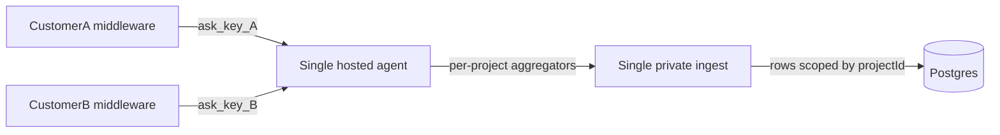
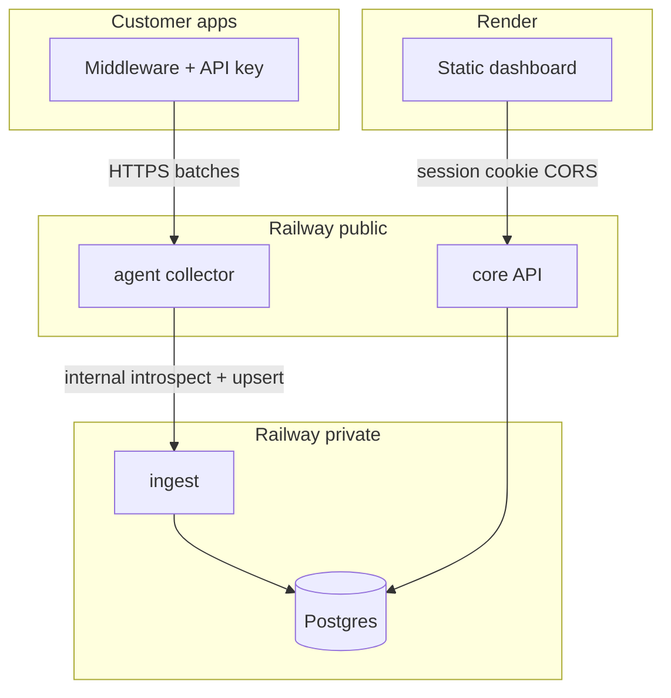

# Railway deployment

Postgres, private ingest, public agent, and public core API run on **Railway**. Static sites are on **Render** — see [RENDER.md](./RENDER.md).

**Start here for the full checklist:** [DEPLOY.md](./DEPLOY.md).  
**Sales demo stack (5 services):** [RAILWAY_ACME_DEMO.md](./RAILWAY_ACME_DEMO.md)

Platform URLs (`*.up.railway.app`) work until custom domains: `api.apiglimpse.com` (core), `collect.apiglimpse.com` (agent).

---

## Tenancy vs service count

You run **one** of each service for everyone — not one agent/ingest per customer.

| Service | Count | Tenancy |
| --- | --- | --- |
| **Agent** | **1** public | Multi-tenant: every customer’s middleware hits the **same** collect URL with **their** `ask_…` key |
| **Ingest** | **1** private | Resolves key → `projectId`; writes that project’s rows |
| **Core** | **1** public | Multi-tenant users/projects via sessions |
| **Postgres** | **1** | All projects in one DB (`projectId` on every row) |



**Isolation is by API key + `projectId`**, not by spinning up a container per customer.

Replicas later = horizontal scale of the **same** multi-tenant services (same public URL), never per-customer deploys.

---

## Service map



| Service | Repo path | Dockerfile | Public? | Role |
| --- | --- | --- | --- | --- |
| Postgres | Railway plugin | — | No | Shared DB |
| ingest | `ingest/` | `ingest/Dockerfile` | **No public domain** | Key introspect + inventory upserts |
| agent | `agent/` | `agent/Dockerfile` | Yes → `collect.apiglimpse.com` | Multi-tenant collector |
| core | `backend/` | `backend/Dockerfile` | Yes → `api.apiglimpse.com` | Auth, projects, inventory reads |
| web | `frontend/` | — | Yes (**Render**) | Dashboard SPA |

**Build context = repo root** for agent, ingest, and backend Dockerfiles.

There is **no** Railway web service for the frontend.

---

## Env matrix

| Variable | Service | Notes |
| --- | --- | --- |
| `DATABASE_URL` | core, ingest | From Railway Postgres plugin (reference variable) |
| `SESSION_SECRET` | core | Long random string |
| `FRONTEND_URL` | core | Dashboard origin: `https://app.apiglimpse.com` (or Render URL until DNS) for CORS |
| `COOKIE_DOMAIN` | core | **Leave unset** (Render and Railway are different registrable domains) |
| `NODE_ENV` | all Railway apps | `production` |
| `PORT` | all | Railway injects; Dockerfiles set defaults |
| `INGEST_URL` | agent | Internal only: `http://ingest.railway.internal:<port>` |
| `ENDPOINT_LIMIT` | ingest | `0` = unlimited; positive = cap new endpoints |
| `AGENT_RATE_MAX` / `AGENT_RATE_WINDOW_MS` / `AGENT_BODY_LIMIT` | agent | Optional; defaults are fine |
| `AGENT_DEBUG_BUFFER` | agent | Leave unset / `false` in production |
| `VITE_API_URL` | **Render** build | Public core URL (see [RENDER.md](./RENDER.md)) |

Customers (middleware):

```bash
API_SENSOR_AGENT_URL=https://collect.apiglimpse.com
API_SENSOR_KEY=ask_...
```

---

## Deploy order (executable runbook)

### 0. Prerequisites

- Railway account + [Railway CLI](https://docs.railway.app/guides/cli) optional but useful
- This repo pushed to GitHub (or connected to Railway)
- Render account for static sites ([RENDER.md](./RENDER.md))
- Full ordered checklist: [DEPLOY.md](./DEPLOY.md)

### 1. Create Railway project + Postgres

**UI**

1. New Project → **Add PostgreSQL**
2. Note the plugin provides `DATABASE_URL`

**CLI (optional)**

```bash
railway login
railway init
railway add --database postgres
```

### 2. Deploy ingest (private)

1. New service from repo
2. **Build context:** repo root
3. **Dockerfile path:** `ingest/Dockerfile`
4. Variables:
   - `DATABASE_URL` = reference Postgres `DATABASE_URL`
   - `NODE_ENV=production`
   - `ENDPOINT_LIMIT=0` (or a positive cap)
   - `PORT=3002` (or let Railway set `PORT` and ensure the service listens on it — app reads `PORT`)
5. **Networking:** do **not** generate a public domain. Enable private networking only.
6. Rename service to **`ingest`**. Note private hostname `ingest.railway.internal` and listen port.
7. Healthcheck path: `GET /health`
8. **Start command:** Dockerfile `CMD` is `npm start` → `prisma migrate deploy` then `node server.js` (same shared migrations as core)

Smoke (from another Railway service shell):

```bash
curl -s http://ingest.railway.internal:3002/health
# expect {"status":"ok"}
```

Ingest must **not** resolve on the public internet.

### 3. Deploy core (public)

1. New service from repo
2. **Dockerfile path:** `backend/Dockerfile` (build context = repo root)
3. Variables:
   - `DATABASE_URL` = Postgres reference
   - `NODE_ENV=production`
   - `SESSION_SECRET=<long-random>`
   - `FRONTEND_URL=https://app.apiglimpse.com` (or `https://<dashboard>.onrender.com` until DNS)
4. Generate a **public** HTTPS domain (`*.up.railway.app`); later attach `api.apiglimpse.com`
5. Healthcheck path: `GET /api/health`
6. Note public URL → used as Render `VITE_API_URL`

Smoke:

```bash
curl -s https://<core-public>/api/health
# expect {"status":"ok","service":"core",...}
```

`npm start` runs `prisma migrate deploy` then the server. **Production schema changes ship
with merge-to-main → Railway auto-redeploy → migrate-on-boot** (core and ingest). Do not
run manual `prisma migrate` against production as part of the release checklist.

### 4. Deploy agent (public)

1. New service from repo
2. **Dockerfile path:** `agent/Dockerfile` (build context = **repo root**)
3. Variables:
   - `NODE_ENV=production`
   - `INGEST_URL=http://ingest.railway.internal:3002`  
     (adjust port if Railway assigned a different listen port — must match ingest’s `PORT`)
   - Optional: `AGENT_RATE_MAX`, `AGENT_RATE_WINDOW_MS`, `AGENT_BODY_LIMIT`
4. Generate a **public** HTTPS domain; later attach `collect.apiglimpse.com`
5. Healthcheck path: `GET /health`
6. Note public URL → customers’ `API_SENSOR_AGENT_URL`

Smoke:

```bash
curl -s https://<agent-public>/health
# expect ok / info-poor health JSON

curl -s -o /dev/null -w "%{http_code}\n" -X POST https://<agent-public>/v1/samples \
  -H 'Content-Type: application/json' -d '{}'
# expect 401 (no key)
```

### 5. Deploy frontend on Render

Follow [RENDER.md](./RENDER.md) / [DEPLOY.md](./DEPLOY.md): static site, `VITE_API_URL=<core-public-url>`.

### 6. Wire CORS

1. Set core `FRONTEND_URL` to the dashboard origin (`https://app.apiglimpse.com` or Render URL)
2. Redeploy core if the variable change does not auto-restart
3. Leave `COOKIE_DOMAIN` unset

### 7. Publish middleware + smoke

See [NPM_PUBLISH.md](./NPM_PUBLISH.md), then [Launch verification](#launch-verification).

---

## Internal `INGEST_URL`

Agent talks to ingest only over Railway private networking:

```bash
INGEST_URL=http://ingest.railway.internal:3002
```

- Use the **service name** Railway assigns (rename the service to `ingest` for a stable hostname).
- Scheme is `http` on the private network (TLS terminates at public edges only).
- If health checks fail with connection errors, confirm private networking is enabled and the port matches ingest’s listen port.

---

## Launch verification

Checklist (run after Render is live). Full end-to-end: [DEPLOY.md](./DEPLOY.md#5-verify).

1. `curl https://<core>/api/health` → ok  
2. `curl https://<agent>/health` → ok  
3. Ingest has **no** public URL; public curl to any guessed ingest host fails  
4. Register / login on dashboard; create project; copy `ask_…` key  
5. Point demo/middleware at public agent URL + key → inventory appears on dashboard  
6. Missing/bad key → agent `401`  
7. Stop/break ingest briefly → agent auth path fails closed (`503` / rejects), does not accept unauthenticated work  
8. Postgres contains schemas/signals only (no raw bodies)

---

## CLI cheatsheet

```bash
railway login
railway link          # select project
railway status
railway variables     # per-service
railway up            # deploy from local (optional vs GitHub)
railway logs
railway shell         # debug inside a service
```

Prefer GitHub → Railway auto-deploy.

---

## Related

- [DEPLOY.md](./DEPLOY.md) — full deploy checklist
- [RENDER.md](./RENDER.md) — static sites
- [INTEGRATING.md](./INTEGRATING.md) — customer middleware + npm publish
- [TESTING.md](./TESTING.md) — local verification
